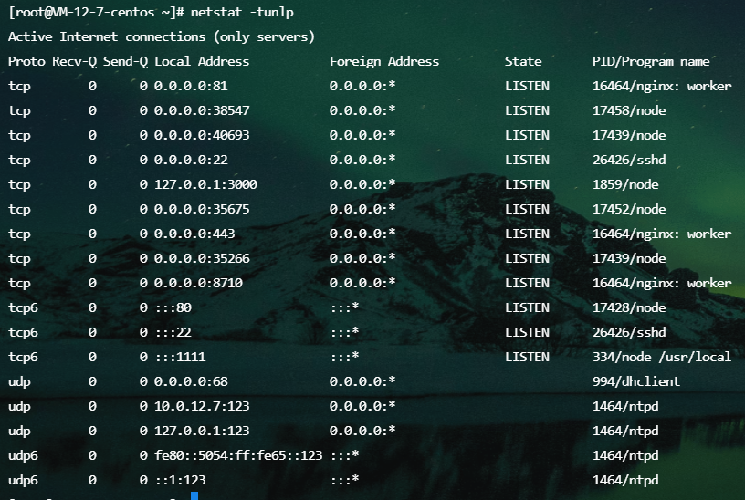
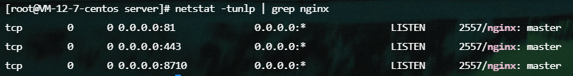

#### linux常用命令

pwd：显示当前目录

cp：复制文件或目录
```
cp index.js index2.js // 把index.js复制到index2.js
cp index.js test/ // 把index.js复制到test目录下
```

mv：移动文件或目录
```
mv index.js user/ // 把index.js移动到user目录下
```

mkdir：创建目录
```
mkdir test // 在当前目录下创建test目录
```

rmdir：删除目录
```
rmdir test // 删除当前目录下的test目录
```

rm：删除文件或目录
```
rm index.js // 删除当前目录下的index.js文件
rm test/* // 删除当前目录下的test目录下的所有文件
```


### (netstat 网络命令)关于端口 | PID | 端口占用情况

netstat -tunlp会打印所有端口占用情况，搭配grep可以查看某个 <font color="red">端口</font> / <font color="red">程序</font> 的占用情况
```
netstat -tunlp | grep 443
```



```
netstat -tunlp | grep nginx
```


### (ps 进程命令)关于进程 | PID | 进程占用情况
ps -aux会打印所有进程占用情况，搭配grep可以查看某个 <font color="red">进程</font>的占用情况
```
ps -aux | grep nginx
```


### 强制杀死进程

杀死pid为123的进程
```
kill -9 123
```

杀死nginx的所有进程
```
killall -9 nginx
```


### 用pm2持久化运行nodejs应用

运行app.js
```
pm2 start app.js
```

关闭app.js
```
pm2 stop app.js
```

查看app.js的运行状态
```
pm2 status
或者
pm2 list
```
